# Contributor Weeks

## DMI, Copenhagen, Denmark, November 2019

The 10 years anniversary PCW took place at the Danish Meteorological Institute
in the very same buildings where it all started almost exactly 10 years earlier
by an informal meeting between DMI (Esben, Lars and Rune) and SMHI (Adam and
Martin) on December 4th, 2009.

This time we were 18 people attending, almost all of us during the entire week,
coming from Polen, Germany, Switzerland, Sweden, Denmark and Italy,
representing 8 different entities (National Met services, EUMETSAT, TechNavia,
and other governmental and environmental institutes). We had a mixture of a few
first time attendees and those who have been attending regularly the last few
years.

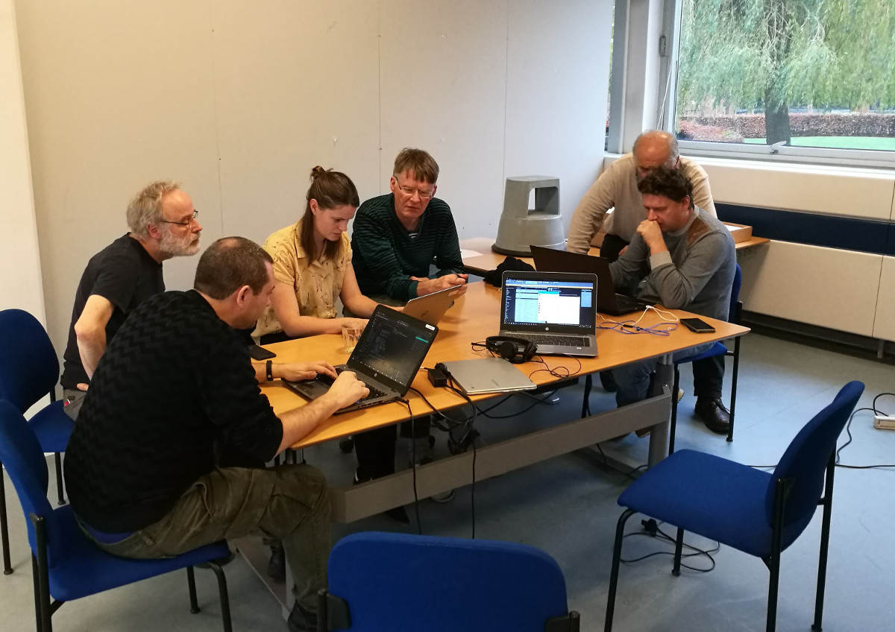
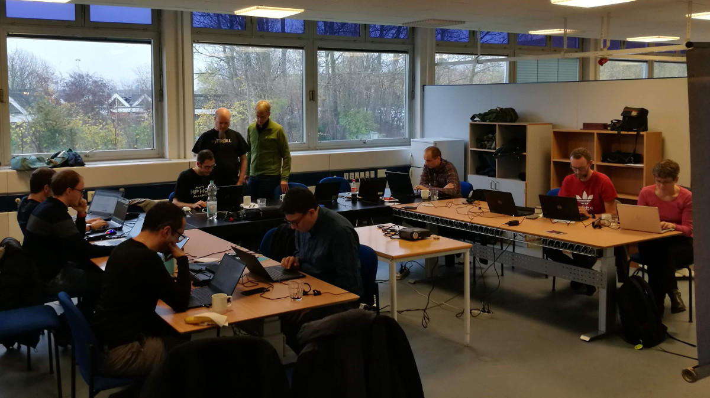
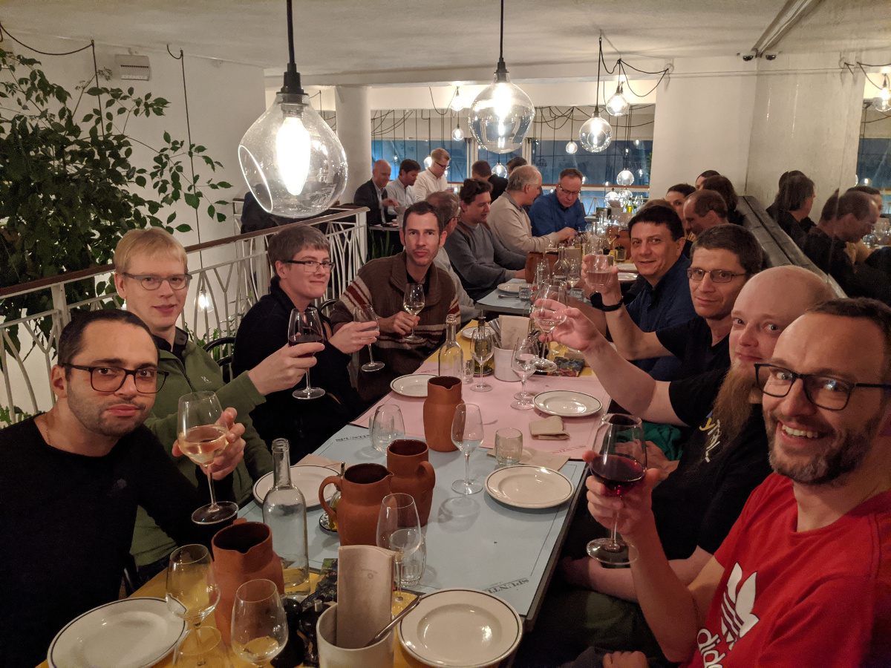

### List of achievements in summary

- FCI reader: Optimisation. The reader is now approximately 30-times faster
  (from 40 minutes to 80 seconds). Work on understanding and possibly fixing
  the current navigation issue (data seems to be shifted x,y km to the south,
  east?). No breakthrough there yet.

- Meteosat-SEVIRI native format handling in Satpy. The HRV band was not
  properly handled for the Eumetsat Native format.

- Adding new masked composites (using cloud mask for example) to Satpy

- Progress on the gradient search resampler, which can in particular heavily
  speed up the bilenar resampling - so far supporting AVHRR and Sentinel-1
  SAR. Work on SEVIRI ongoing.

- Updating and improving the documentation in several modules. In Pyresample
  updated doc and examples on quicklook plotting.

- Enhancing Pyorbital with functionality to calculate Simultaneous Nadir
  Overpasses (SNOs) from two satellite platforms.

- Progress on padding nodata (e.g. missing segments) in Geostationary satellite
  data in Satpy. Without padding the resampling LUTs cannot be reused for each
  dataset, heavily affecting the computation speed.

- Much work and progress on ninjotiff image generation. Validation with
  synthetic images, and tests added to check colormaps, scales and offsets.

- Work and testing of Trollflow2 and containers- testing EARS-VIIRS, SEVIRI
  HRIT, EARS-AVHRR.

- Test and verifying Satpy tutorials.

- A new projection (transverse Mercator) added to the Satpy netCDF/CF writer.

- Work on a-train match and cartopy.

- Many small bugs fixed.

## SSEC, Madison, WI, USA, May 2019

A Pytroll contributor week took place at the Pyle Center on the University
of Wisconsin - Madison Campus hosted by the Space Science and Engineering
Center (SSEC) in Madison, WI, USA from 13th to 17th of May, 2019. This was
the first workshop in the Americas with a total of 24 people attending
through the week. Attendees came from Europe and North
America including many first time attendees from the SSEC, CIRA, NRL, and
NOAA.

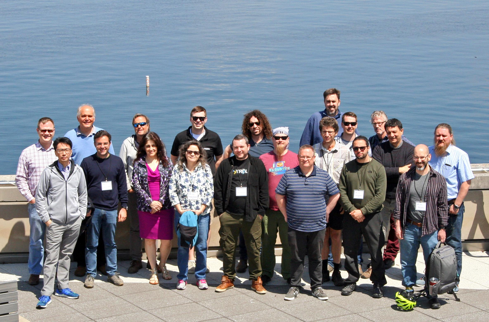

## EUMETSAT Head Quarters, Darmstadt, Germany, November 2018

A Pytroll contributors week (previously called PyTroll developers workshop)
took place at EUMETSAT, Darmstadt, Germany from 26th to 30th of November, 2018.

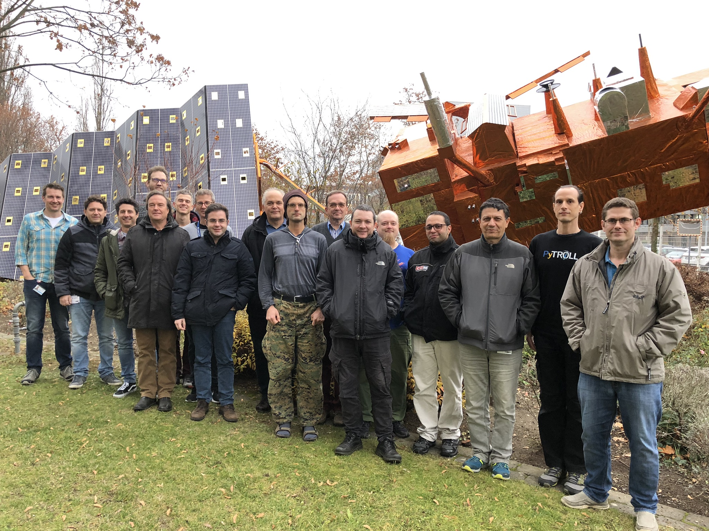

A record number (24, though some only a couple of days) Pytroll developers and
users gathered together during one week to fix bugs, document, enhance and
improve functionality of the Pytroll suite of software packages. The following
organisations were represented:

- EUMETSAT
- Deutscher Wetterdienst (DWD), Germany
- MeteoSwiss
- Met Norway
- Finnish Meteorological Institute Institute (FMI)
- Swedish Meteorological and Hydrological Institute (SMHI)
- Estonian Environment Agency (EEA)
- Technavia, Switzerland
- University of Marburg, Germany
- National Institute for Geophysics and Vulanology (INGV), Italy

### List of achievements in summary

- A way to handle GSICS calibration in SatPy readers
- Native msg HRV area definition for ROI (region of interest) files
- Add unittests for native_msg area_extent calculations
- Add MPEF product reader
- Add GOES-15 netCDF reader
- Port MTSAT-1R/2 HRIT readers from mipp to satpy 
- Fix #414 (geostationary radiance units)
- Flake8-ify all of SatPy
- Satpy xarray/dask and pyninjotiff compatibility
- Add MSG hrit PROLOGUE and EPILOGUE metadata when saving a dataset to netCDF format (MeteoSwiss, Lorenzo)
- Daskify near-infrared reflectance part in pyspectral
- Speed up pytroll-schedule and factorize and increase test coverage
- Solve PySpectral RSR download issue and fix PRs, use versioneer

### Other items worked at but not yet finished

- Implement coastlines for b/w-images
- FCI reader to work with the new test dataset
- Add colormaps for SceneType
- Document Trollflow production chain
- Naming convention for readers
- PyMonitor: package to monitor and easily manage pytroll flow
- Python 2 vs Python 3: current state
- Add basic satpy scene to geoviews method
- Add Modis mod35_l2 reader (cloud mask)
- Add hdf5 MSG reader
- Ninjotiff configuration can be passed to pyninjotiff

## Norwegian Meteorological Institute, Oslo, April, 2018

The Pytroll workshop for spring 2018 took place at the Norwegian Meteorologisk Institutt, in Oslo, Norway, 
from Monday April 23rd to Friday April 27th 2018.

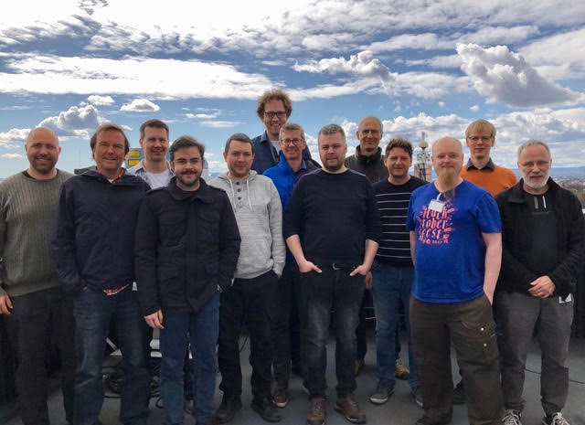

## Centre Météorologie Spatiale (CMS), Météo-France, Lannion, September 2017

A pytroll developers workshop took place at the Céntre Météorologie Spatiale in Lannion, Brittany, France, from 11-15 of
September 2017. 15 participants from several national Meteorological Institutes in Europe, incldung Switzerland, Germany, 
Denmark, Iceland, Finland, Sweden, and France, worked concentrated during one week improving and enhancing the Pytroll software.

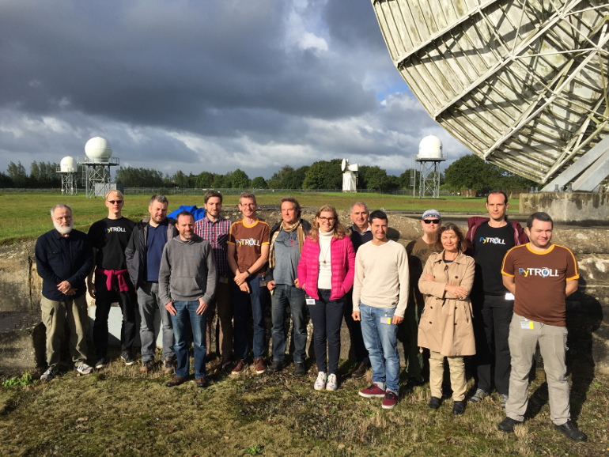

### Summary achievements

- Fine tuning for operational duties:
  - GOES-16  → NinJo projection
  - Satpy Ninjotiff 
- Enhanced visualizations (smoothing, overplotting in transparence, …) of some NWCSAF v2016 CMIC products 
  (short presentation by Lorenza)
- fogpy - a FLS (Fog/Low stratus) detection algorithm with Pytroll (Short presentation by mastho)
- Made a new draft Pytroll web main page at pytroll.github.io. Discussing migration of the old one at pytroll.org
- Reading MTG FCI data (CharLS compression): [Presentation](https://docs.google.com/document/d/1_U_FnYuevBiUpgYqBgm5dyzcRBy3ZDM8RjcknBImJ-U/edit)
- Georeferencing hrit, preparing for the change of earth model
- Maia reader in satpy
- Discussed Solar correction on the snow age - but not feasible!
- Aggdraw works with Python 3

- Pytroll file utils (Trollmoves)
  - Move_it server/mirror/client setup
  - Move_it server/mirror/client more robust ? (plugin to heartbeat handler ?)
  - SFTP transfer
  
  
- Pyninjotiff 
  - https://github.com/pytroll/pyninjotiff
  - Pyninojotiff: a command line interface (good for non-programmers). E.g. to convert a geo-tiff (or raster) image to 
    a ninjotiff format (ninjo tags could be defined on command line or in a configuration file).  
  - How can pyninjotiff be used with satpy?

- Pyresample
  - Make pyresample use dask (optionally)

- Satpy
  - Migration from mpop to satpy
    - How to convert custom composites
    - What are the differences in usage
  - Port satpy readers to xarray
  - Migrate atmospheric correction to trollflow-sat or satpy ?
  - Work on cf-writer

- Pytroll-Schedule
  - Fix two deprecation warning from Numpy
  - Handle Terra global dumps

- Pyspectral
  - Atmospheric correction - accounting for limb cooling DWD parametric method implemented in pyspectral and satpy
  - Use GIT-LFS for LUTs and RSR data
  - Rayleigh LUT tables and RSR data on zenodo.org
  - Numpy 1.13-1.12 and masked array bug reported on numpy github

## RSHU, Saint Petersburg, Russia, March 2017

A pytroll developers workshop was held at the Russian State Hydrometeorological University (RSHU) 
in Saint Petersburg, Russia, between March 27th and 31st, 2017. We were around 20 participants from 
various National Meteorological Institutes, universities and companies.

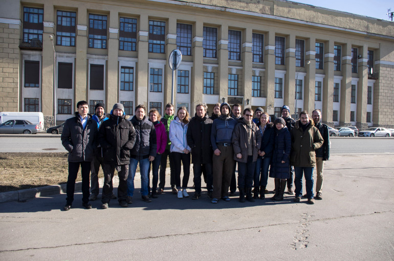

## FMI, Helsinki, Finland, November 2016

A pytroll developers workshop was held at the Finnish Meteorological Institute (FMI) in Helsinki between November 
28th and December 2nd, 2016. We were 14 developers from various National Meteorological Institutes and companies 
around Europe.

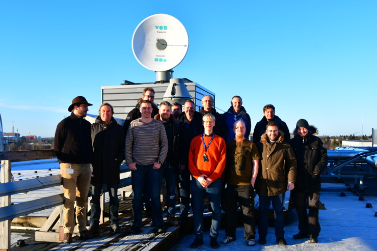

## DWD, Offenbach, Germany, June 2016

A pytroll developers workshop was held at the Head Quarters of Deutscher Wetterdienst (DWD) in Offenbach between 
June 13 and 17, 2016. With the paticipation of 18 developers from the national Met Services of Switzerland, 
Norway, Denmark, Sweden, Finland and Germany, as well as EUMETSAT it was the largest to date.

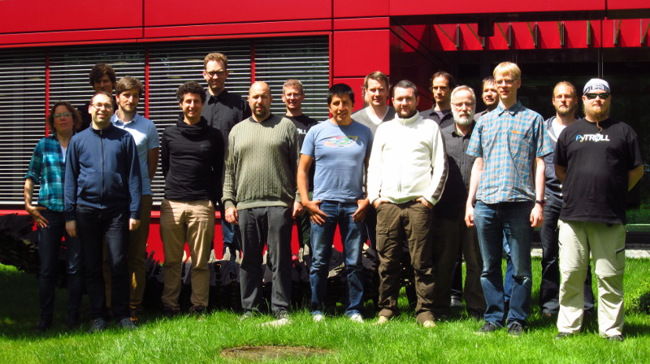

## MeteoSwiss, Locarno, Switzerland, Dec 2015

Pytroll workshop in Locarno, Switzerland in December 2015

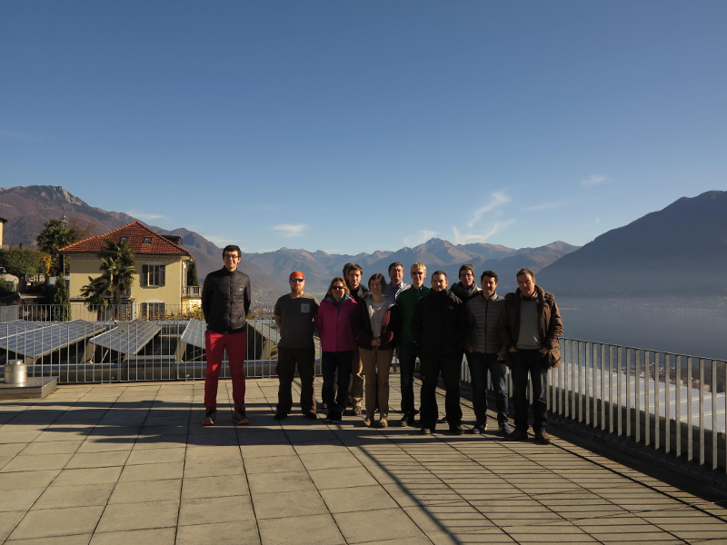

## SMHI, Norrköping, Sweden, June 2015

Pytroll workshop in Norrköping, Sweden in June 2015

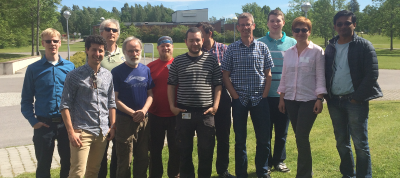

## SMHI, Norrköping, Sweden, November 2013

After a two day open workshop we were 7 pytrollers from Finland, Iceland and Sweden staying till the end of week working 
together on some pressing issues. See below for a summary of achievements. If you would like to contribute actively with 
the pytroll development, please let us know at the mailing list (pytroll@googlegroups.com) or chat with us directly on the 
pytroll slack: https://pytrollslackin.herokuapp.com/. We plan to have two pytroll weeks (usually 4-5 days of dedicated 
programming) each year. Usually we will identifiy a few specific topics that we think needs special attention.

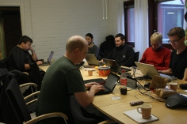
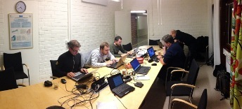

### Summary achievements

 - Extending the user community: Several new users have become more familiar with Pytroll and started contributing.
 - Testing: A number of bugs and user inconveniences were identified, and some have been solved already.
 - Enhancements to Pyresample:
   - Now Pyresample allows to attach a weight to the gaussian reprojection method. This is convenient when e.g. gridding
     several swath products into a level 2.5/3 product (Climate applications).
 - MIPP enhancements and user documentation: MIPP allows XRIT decompression on the fly, and MIPP documentation 
   slightly improved.
 - Three new projects initiated:
   - Pydecorate to add logos, text, color bars and stuff to images
   - Trollimage - an enhancement of the image.py module in mpop including some color enhancements. 
     Will deprecate image.py in mpop
   - Trollduction - A modular batch production framework for Pytroll
 - netCDF reader for SSM/I
 - Trollcast testing, for data exchange between SMHI and FMI - resolution is pending (time outs)
 - Designing and developing the FMI Pytroll based polar production system. Probably resulting in a general concept that can
   be useful to other users
 - Looking at how to enable web based batch production monitoring with Pytroll. Could e.g. be used for an easy and quick access
   to Pytroll products for in-house R&D
 - Initiated an overhaul and check of the EUMETSAT recipe RGBs in Pytroll and how they compare and deviate with the official
   ones. Done in collaboration with the Romanian Met Service.
 - Colorizing Pytroll images (using the new trollimage component) - "sandwich" product. Color enhanced imagery is commonly
   used in forecast offices, e.g. IR imagery with cold temperatures enhanced using a color palette.

### Presentations at the workshop

Watch all the presentations on [youtube](http://www.youtube.com/watch?v=WEk95gxO8sE)!

- [Pytroll history](https://docs.google.com/presentation/d/1vrtn0kNEWPQE02sZmQwqSfk1Ax3NO9BW5sRZ8mN-x6w/edit)
- [Rationale and motives](https://docs.google.com/presentation/d/1dLv5m56ETmr21HsjPTI_N5Ix-2zguUN2-5wKPZ0Z6Fk/edit)
- [Pyresample](https://docs.google.com/presentation/d/1rkM-5HNqn0Wj5BlIQVFvyzCMYfS_DfnG-zw4OuzrRzU/edit)
- [Mpop](https://docs.google.com/presentation/d/1drrlj97iNlETq-WNeUJF_01FWDuERyvWRJVTmg1_dd0/edit)
- [Mipp](https://docs.google.com/presentation/d/11077fLfpjWmJUi8mfGWeT7awXSeRF82jnFcIEDUFCZI/edit)
- [Pyorbital](https://docs.google.com/presentation/d/10ZDJ8MiHu5-gpSAOUctvhVTxyqJn3VO8zJNSA2TGjKo/edit)
- [Python-bufr](https://docs.google.com/presentation/d/166xxfcCW072YuHmz-u5C0CP559HUuH5lOYmQErdOjCU/edit)
- [Pycoast](https://docs.google.com/presentation/d/1c9zrXutazOs8rXhItEiUlWb5K_lBhewHAlrnzmYxoBw/edit)
- [Geotiepoints](https://docs.google.com/presentation/d/1AhdZhgOLlbHHNAAEQv1JflFTmPTV3ziOQLhBF2jQWr8/edit)
- [Posttroll](https://docs.google.com/presentation/d/18emgrIlTxdz-r-c5UrG6M5Y2QQyJ70g34wKbhWFFsjM/edit)
- [Trollcast](https://docs.google.com/presentation/d/1I7q6kgm4K2pEL8QP0SJkGsHDH5f3UHnDYe5GCA9NB_g/edit)
- [Pyspectral](https://docs.google.com/presentation/d/1Re076BDSrzodiPS9fvLZOZdWWejJ7jqo3BqGl_xicp4/edit)
- [Other pytroll projects](https://docs.google.com/presentation/d/1RL9nr2pvo9vG-WaNtckhRJWdO4bLBSPC53nYc3g3mjQ/edit)
- [Tools](https://docs.google.com/presentation/d/1AMZt0jBMYem8g7tbNOvz9MEWRm-DbwNCBv9KJPA32cE/edit)

## SMHI, Norrköping, Sweden, November 2012

The first open Pytroll workshop was held in Norrköping, Sweden, end of November, 2012. Nine programmers or satellite 
experts from Holland, Finland, Romania and EUMETSAT joined up with the pytroll teams at DMI and SMHI, to get more 
acquainted with the pytroll tools and how it can be used in their local environments for satellite data production.

Hard work at the 2012 workshop in Norrköping, Sweden:

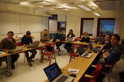
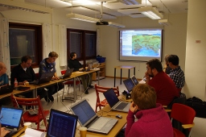

### Presentations at the workshop

- [Rationale and motives](https://docs.google.com/presentation/d/1dLv5m56ETmr21HsjPTI_N5Ix-2zguUN2-5wKPZ0Z6Fk/edit)
- [Pyresample](https://docs.google.com/presentation/d/1rkM-5HNqn0Wj5BlIQVFvyzCMYfS_DfnG-zw4OuzrRzU/edit)
- [Mpop](https://docs.google.com/presentation/d/1drrlj97iNlETq-WNeUJF_01FWDuERyvWRJVTmg1_dd0/edit)
- [Mipp](https://docs.google.com/presentation/d/11077fLfpjWmJUi8mfGWeT7awXSeRF82jnFcIEDUFCZI/edit)
- [Pyorbital](https://docs.google.com/presentation/d/10ZDJ8MiHu5-gpSAOUctvhVTxyqJn3VO8zJNSA2TGjKo/edit)
- [Python-bufr](https://docs.google.com/presentation/d/166xxfcCW072YuHmz-u5C0CP559HUuH5lOYmQErdOjCU/edit)
- [Pycoast](https://docs.google.com/presentation/d/1c9zrXutazOs8rXhItEiUlWb5K_lBhewHAlrnzmYxoBw/edit)
- [Geotiepoints](https://docs.google.com/presentation/d/1AhdZhgOLlbHHNAAEQv1JflFTmPTV3ziOQLhBF2jQWr8/edit)
- [Posttroll](https://docs.google.com/presentation/d/18emgrIlTxdz-r-c5UrG6M5Y2QQyJ70g34wKbhWFFsjM/edit)
- [Trollcast](https://docs.google.com/presentation/d/1I7q6kgm4K2pEL8QP0SJkGsHDH5f3UHnDYe5GCA9NB_g/edit)
- [Other pytroll projects](https://docs.google.com/presentation/d/1RL9nr2pvo9vG-WaNtckhRJWdO4bLBSPC53nYc3g3mjQ/edit)
- [Tools](https://docs.google.com/presentation/d/1AMZt0jBMYem8g7tbNOvz9MEWRm-DbwNCBv9KJPA32cE/edit)

